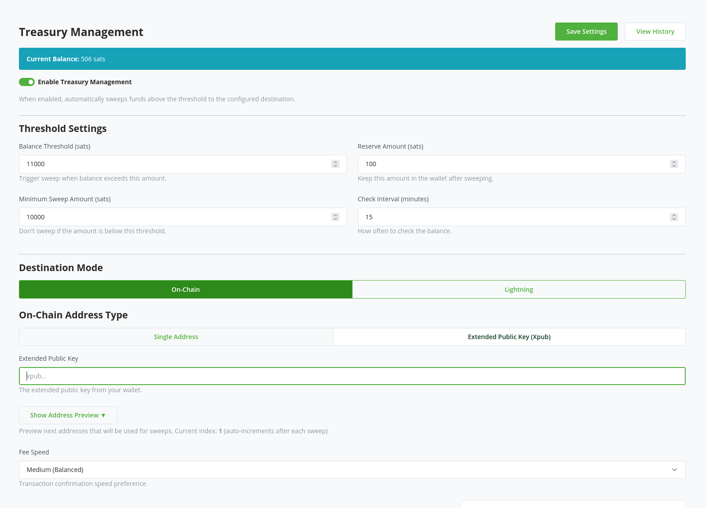

# BTCPayServer Breez Plugin

A BTCPayServer plugin that enables Lightning payments using Breez's nodeless SDK (Spark) as a Lightning backend, eliminating the need to run a full Lightning node.

## Overview

This plugin allows BTCPayServer merchants to accept Lightning payments through Breez's non-custodial, nodeless Lightning infrastructure. Instead of maintaining a Lightning node with liquidity and channel management, merchants can use Spark based Lightning node backend. 

## Features

- **Nodeless Lightning**: No need to run or maintain a Lightning node and deal with liquidity issues
- **Treasury management**: Automatically sweep funds to L1 or lightning address based on your configuration
- **Non-custodial**: You maintain control over your funds (on Spark)

## Treasury


## Installation

Download and install the plugin from the GitHub releases:
https://github.com/aljazceru/btcpayserver-breez-nodeless-plugin/releases


## Configuration

Connect your BTCPayServer instance to Breez using a connection string:
```
type=breez;key=<your_payment_key>
```

## Requirements

- BTCPayServer instance
- BreezSDK API key


